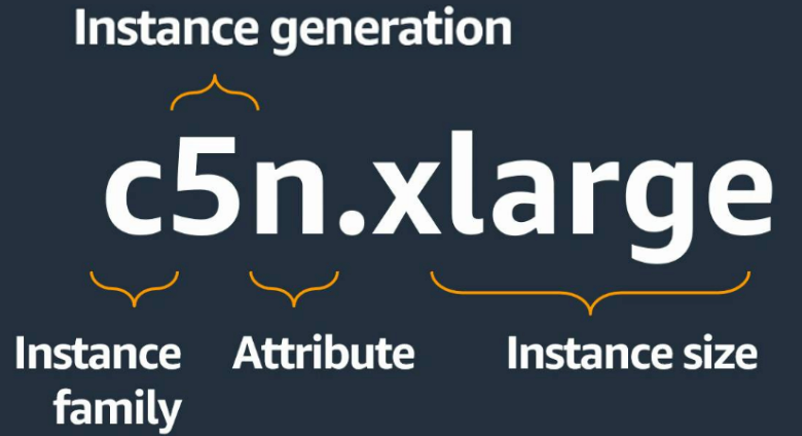

## EC2 (Elastic Cloud Compute)
Scalable , Resizable , Compute capacity in the cloud

## AMI (Amzon Machine Image)
It is an preconfigured template that contains software configuration to launch an Instance

## Types
* General purpose
* Compute Optimized
* Memory Optimized
* Storage Optimized
* Accelarated 

## Instance Families
    C – Compute
    D – Dense storage
    F – FPGA
    G – GPU
    Hpc – High performance computing
    I – I/O
    Inf – AWS Inferentia
    M – Most scenarios
    P – GPU
    R – Random access memory
    T – Turbo
    Trn – AWS Tranium
    U – Ultra-high memory
    VT – Video transcoding
    X – Extra-large memory

## Additional capabilities
    a – AMD processors
    g – AWS Graviton processors
    i – Intel processors
    d – Instance store volumes
    n – Network and EBS optimized
    e – Extra storage or memory
    z – High performance
