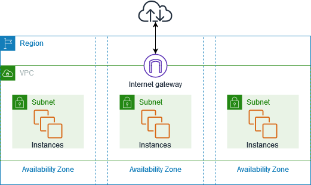

## VPC (Virtual Private cloud)
A VPC is a virtual network that you create in the cloud. It allows you to have your own private section of the internet, just like having your own network within a larger network. Within this VPC, you can create and manage various resources, such as servers, databases, and storage.

Check the Official Docs

https://docs.aws.amazon.com/vpc/latest/userguide/vpc-example-private-subnets-nat.html