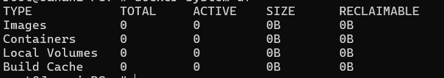
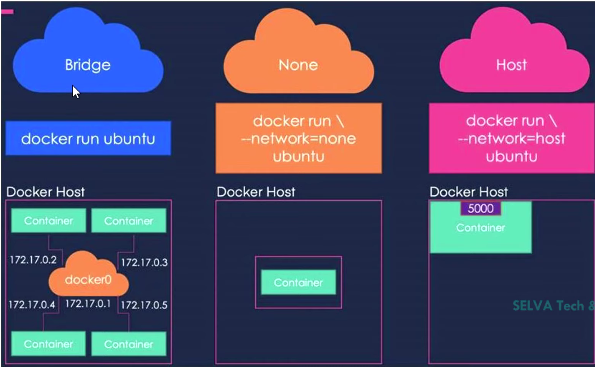
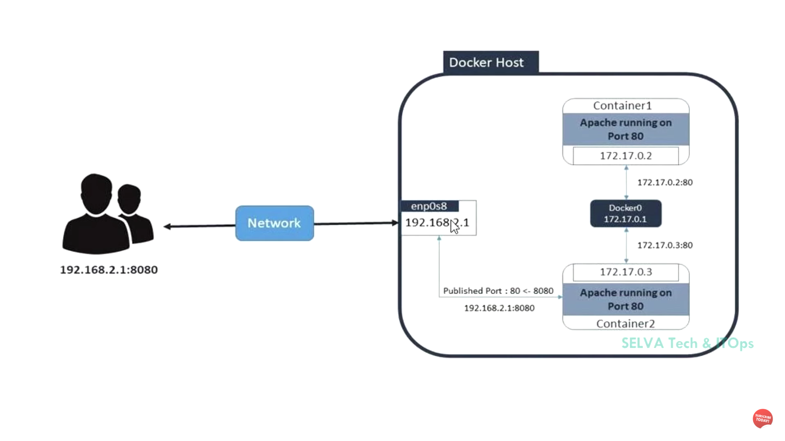
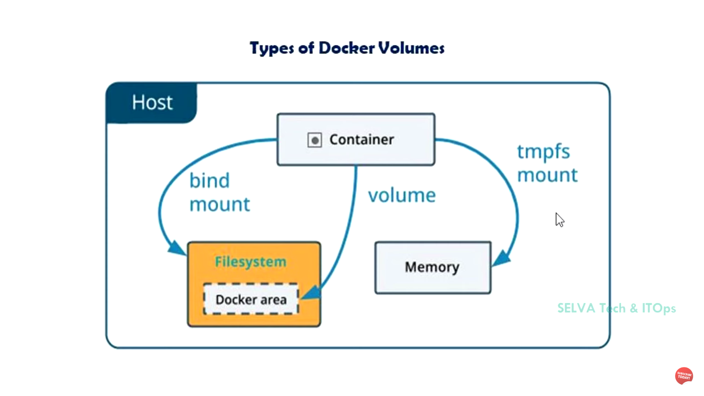

*  To delete the unwanted data in the system `docker system prune`
*  to search the docker images from the dockerhub `docker search <content>`

* Download images from the docker hub `docker pull <image_name>`

* To analyize how much storage the resources are occupied `docker system df`

* To See status of the Docker Images `docker ps -a`

* To run the container `docker run -d --name <container_name> <image_name>`
    Why we use the `-d` without using it blocks the terminal like after running of the container we close it then we proceed further commands (It runs in the foreground)

    When We use the `-d` it runs the container in the background 

* To show the storage level of the Each Image, Container Info `docker system df`

* To navigate into the container `docker exec -it <container_name> /bin/sh`
    * cd bin
    * Inside this bin folder it shows all the runnable commands for that specific container

* To start the container `docker start <container_name or id>`
* To Stop the container `docker stop <container_name or id>`
* To See the logs of the container `docker logs <container_name OR id>`
* Port Forwarding `docker run -d --name <container_name> -p external-port:listing_port_of_the_container <image_name>`
    * Eg  `docker run -d --name web2 -p 81:80 httpd`
    * To see the output first to find the ip of the Docker Host `ip a` -> After enter this find the `eth0` after this one that is the ip of the host (external_port) paste it to the new tab then add `:` enter the port no of the `external_port`
* To Inspect an Container use this `docker inspect <container_name>` we can find the listing port of the container
* docker commit <container_name> <message>
* To rename an image `docker tag <old_name> <new_name>`
* TO push the image to DockerHUB `docker push <image_name>` In that we want to login 
    * `docker login -u <username>`
    * ### The Image Name should be like this 
        `username\image_name` `mdabucse\first`

## Docker Network

#### `IMP` When we run an os based containers definitely run in the `-it` interactive mode otherwise it exits automatically

* To see the ouput in the browser we definitely do the `PORT FORWARDING`

* Auto Port Mapping `-P` during the creation of new container when we use this Capital P It randomly assign the port number to webhost

### Types Of Storage in Docker

## Docker Volumes
* To create a volume `docker create <volume_name>`
* To Inspect the Volumes `docker volume inspect <volume_name>`
* To mount an volume to an container `docker run -d -it --mount source=<path>,destination=<path> <image_name>`
    * `source` add the path of the mount storage
    * `destination` where to mount in the container path 
