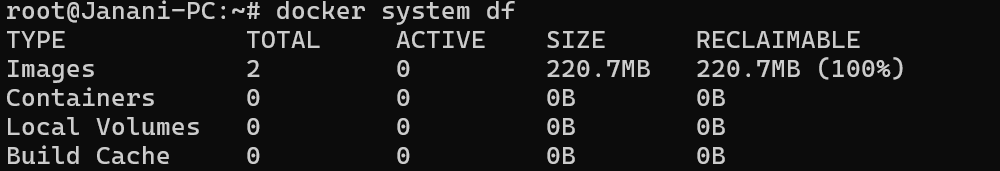

*  To delete the unwanted data in the system `docker system prune`
*  to search the docker images from the dockerhub `docker search <content>`

* Download images from the docker hub `docker pull <image_name>`

* To analyize how much storage the resources are occupied `docker system df`

* To See status of the Docker Images `docker ps -a`

* To run the container `docker run -d --name <container_name> <image_name>`
    Why we use the `-d` without using it blocks the terminal like after running of the container we close it then we proceed further commands (It runs in the foreground)

    When We use the `-d` it runs the container in the background 

    

